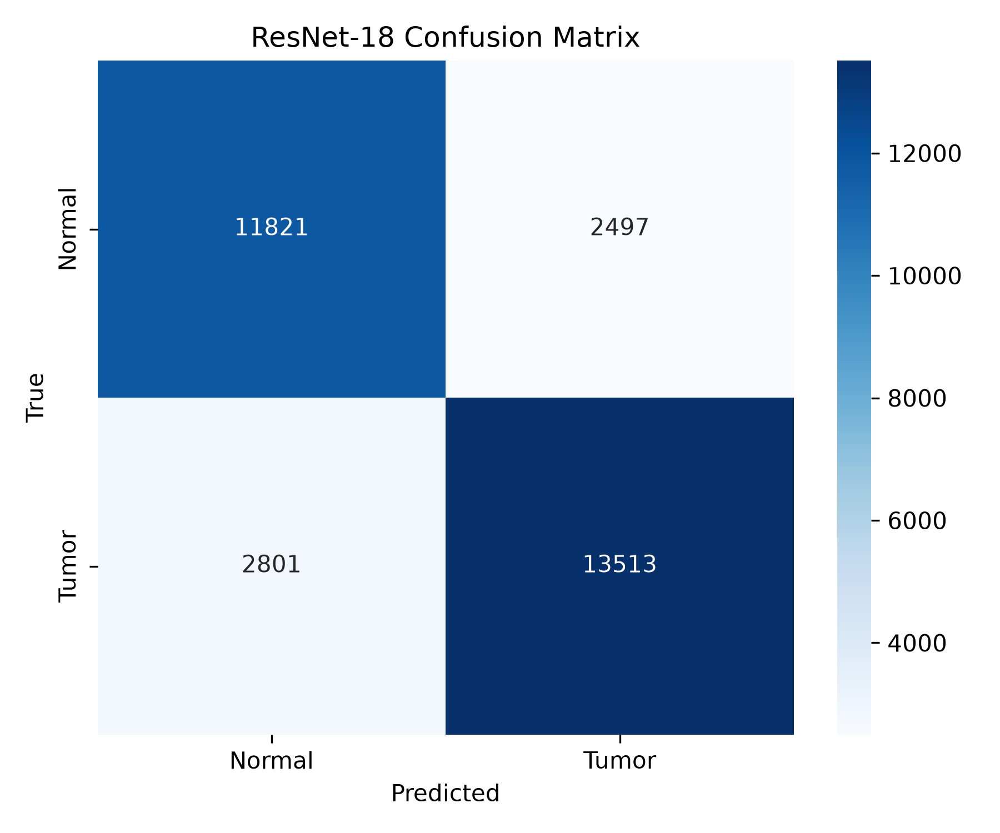

# 🧠 Brain MRI Tumor Classification using Multi-Modal MRI and Explainable AI

A deep learning framework for **brain tumor slice classification** using the **BraTS 2023 dataset** and **ResNet-18** with **Grad-CAM** explainability.

---

## 📌 Project Overview

Brain tumor diagnosis from MRI scans is a challenging medical imaging task that requires both high classification performance and model interpretability.

This project presents a complete deep learning pipeline that:

- Uses four MRI modalities
- Classifies brain MRI slices into Tumor / Non-Tumor
- Applies Explainable AI using Grad-CAM
- Produces visual explanations of model decisions

The project was developed using the **BraTS 2023 dataset** and serves as a foundation for future research in trustworthy and explainable AI for medical imaging.

---

# Features

- Multi-modal MRI classification
- Patient-level train/validation split
- ResNet-18 Transfer Learning
- GPU training with PyTorch
- Grad-CAM Explainability
- Publication-quality Grad-CAM visualizations
- Modular project structure
- Fully reproducible pipeline

---

# Dataset

Dataset:

**BraTS 2023**
(Brain Tumor Segmentation Challenge)

MRI Modalities

- T1
- T1CE
- T2
- FLAIR

Segmentation masks were used only to generate slice-level labels.

---

# Model

Backbone:

ResNet-18 (ImageNet pretrained)

Input:

4-channel MRI

Output:

Binary Classification

- Normal Slice
- Tumor Slice

Loss Function

CrossEntropyLoss

Optimizer

Adam

Learning Rate

0.0001

Epochs

5

---

# Results

| Metric | Score |
|---------|-------|
| Accuracy | **82.70%** |
| Precision | **84.40%** |
| Recall | **82.83%** |
| F1 Score | **83.61%** |

---

# Explainable AI

This project implements **Grad-CAM** to visualize the regions of MRI slices that contribute most to the model's prediction.

The generated visualizations help improve model interpretability and provide insight into the decision-making process.
---

# Project Structure

```
BrainMRI-XAI-Robustness
│
├── data/
│   └── raw/
│
├── src/
│   ├── datasets/
│   ├── explainability/
│   ├── models/
│   ├── preprocessing/
│   └── training/
│
├── scripts/
│   ├── train_resnet.py
│   ├── evaluate_resnet.py
│   ├── generate_gradcam.py
│   ├── generate_gradcam_gallery.py
│   └── plot_roc_curve.py
│
├── results/
│   ├── dataset_statistics/
│   ├── resnet18/
│   ├── gradcam/
│   └── gradcam_gallery/
│
├── requirements.txt
├── README.md
└── LICENSE
```

---

# Installation

Clone the repository

```bash
git clone https://github.com//premdeepgedela-svg/BrainMRI-Classification-with-XAI
cd BrainMRI-Classification-with-XAI

```

Create a virtual environment

```bash
conda create -n brainmri python=3.11

conda activate brainmri
```

Install dependencies

```bash
pip install -r requirements.txt
```

---

# Training

Train the ResNet-18 classifier

```bash
python -m scripts.train_resnet
```

---

# Evaluation

Evaluate the trained model

```bash
python -m scripts.evaluate_resnet
```

## Confusion Matrix

<p align="center">
  
</p>
---

# Generate Grad-CAM

Generate Grad-CAM visualizations

```bash
python -m scripts.generate_gradcam
```

Generate a Grad-CAM gallery

```bash
python -m scripts.generate_gradcam_gallery
```
## Grad-CAM Example

<p align="center">
  
</p>

---

# Example Results

## Classification Performance

| Metric | Value |
|---------|------:|
| Accuracy | **82.70%** |
| Precision | **84.40%** |
| Recall | **82.83%** |
| F1 Score | **83.61%** |

---

## Grad-CAM Examples

Example visualizations generated by the model:

```
[Original MRI] → [Grad-CAM Heatmap] → [Overlay]
```
| Tumor Example | Normal Example |
|---------------|----------------|
|  |  |

| Tumor 1 | Tumor 2 |
|----------|----------|
|  |  |

| Normal 1 | Normal 2 |
|-----------|-----------|
|  |  |

---

# Technologies Used

- Python
- PyTorch
- Torchvision
- NumPy
- OpenCV
- Matplotlib
- Scikit-learn
- NiBabel
- BraTS 2023 Dataset

---

# Future Work

Possible future extensions include:

- Vision Transformer (ViT) models
- EfficientNet-based classifiers
- 3D CNN architectures
- Attention-based explainability
- Multi-class tumor subtype classification
- Explainability robustness under distribution shifts
- Clinical validation on external datasets

---

# References

1. **BraTS 2023 Challenge Dataset**
2. He K., Zhang X., Ren S., Sun J. *Deep Residual Learning for Image Recognition*. CVPR 2016.
3. Selvaraju R. R., et al. *Grad-CAM: Visual Explanations from Deep Networks via Gradient-Based Localization*. ICCV 2017.

---

# Acknowledgements

This project uses the BraTS 2023 dataset provided by the Brain Tumor Segmentation Challenge organizers.

Special thanks to the researchers and contributors who made the dataset publicly available for medical imaging research.

---

# Author

**Gedela Premdeep**

B.Tech in Computer Science and Engineering

Research Interests:

- Medical Image Analysis
- Explainable AI (XAI)
- Computer Vision
- Deep Learning
- Trustworthy AI

---

# License

This project is licensed under the MIT License.